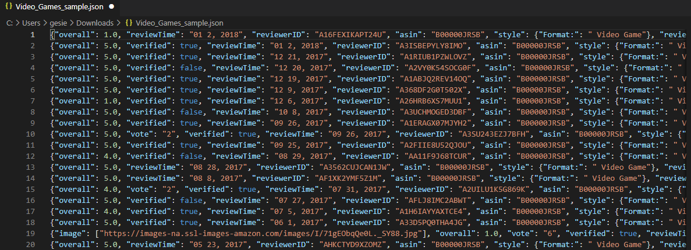
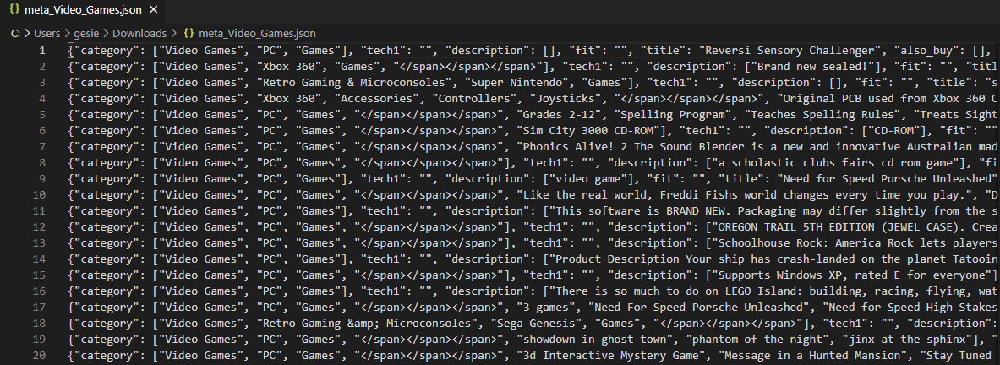

# Assignment 20

# Projeto de Classificação e Recomendação

Assignment #20 é um mix de conteúdos de Classificação e Recomendação vistos até agora no curso Data Expert da DNC

## CONTEXTO

O CEO da Amazon contratou um time de cientistas de dados para trabalhar em diferentes vertentes da empresa, e você ficou encarregado de **fazer um sistema de recomendação para
os clientes Amazon.**

Para isso, foram disponibilizados dois arquivos ***Json.***

um arquivo de metadados com as informações dos itens:

e outro com as avaliações de usuários:

## O PROJETO

O algoritmo de recomendação deve ser exclusivamente em cima de avaliações verificadas (campo `verified=True`no arquivo de avaliações).

Há uma base sem classificação no sistema de recomendação (valores com missing value na coluna `verified`). Será preciso classificar se estas avaliações são verificadas ou não, e no caso positivo,
adicioná-los no sistema de recomendação.

Tarefas realizadas:

- Carregar, limpar e fazer análises exploratórias no banco de dados fornecido;
- Classificar a base sem informação para incluir as observações das avaliações verificadas no sistema de recomendação;
- Desenvolver e entregar um sistema de recomendação, com exemplos de aplicação.